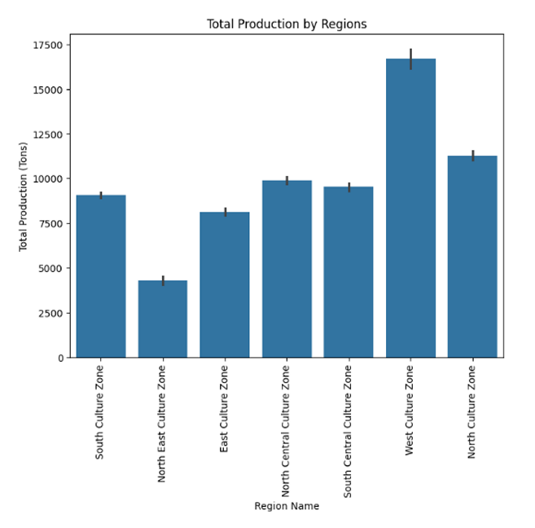
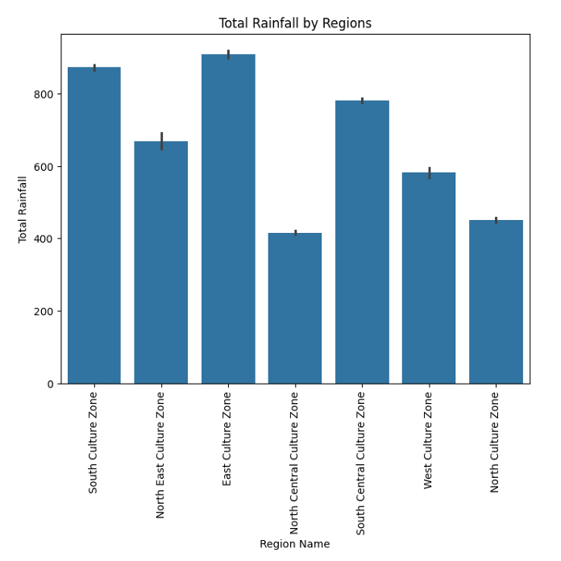
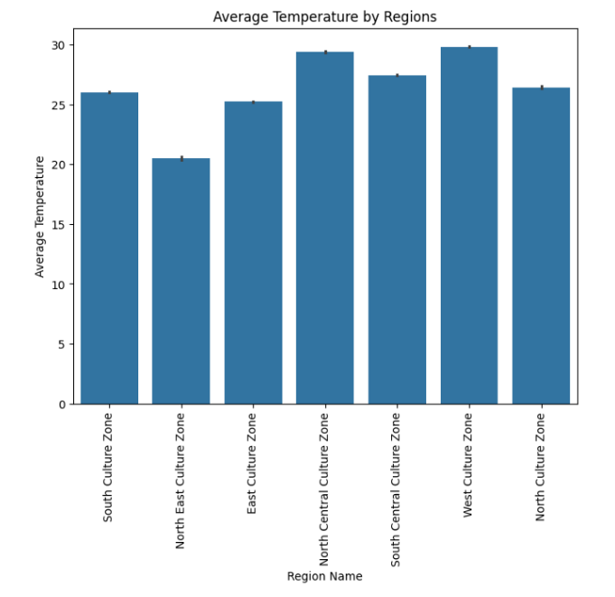
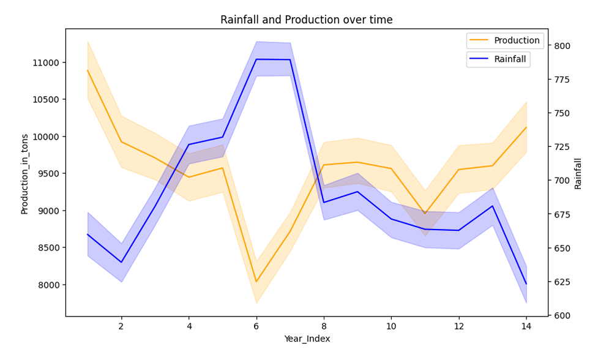
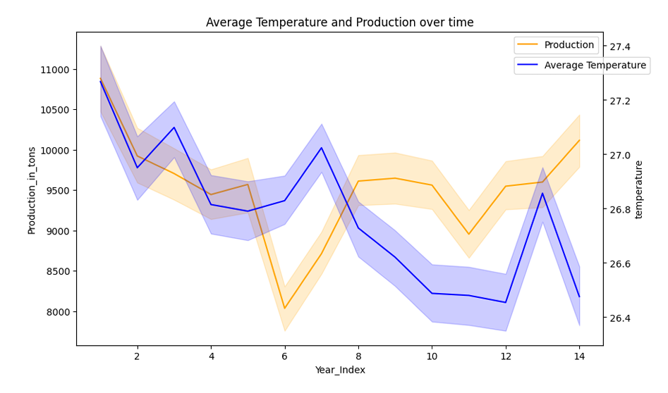
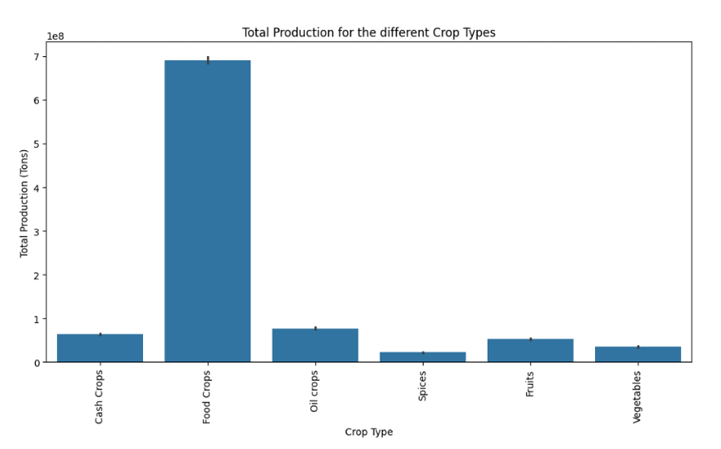
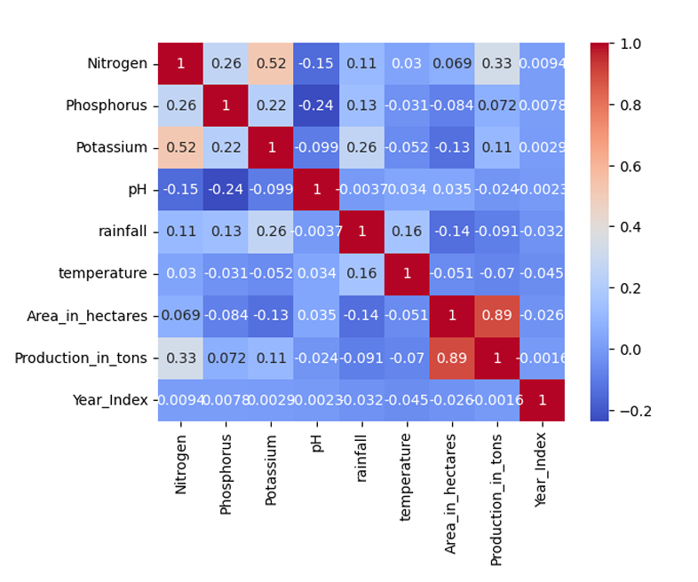
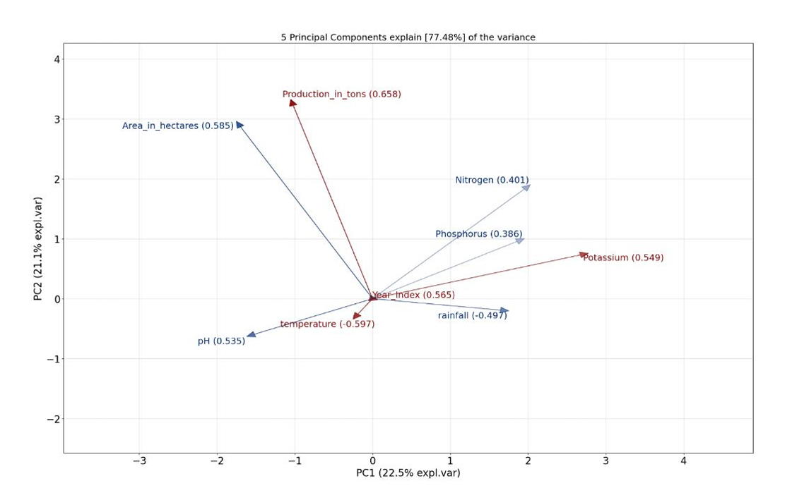
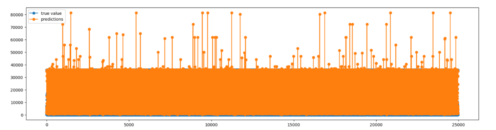

# Crop Production Analysis in India using Statistical Modeling

This project analyzes agricultural production data in India using statistical methods and modeling techniques to identify key environmental and soil-related factors influencing crop yield.

---

## 🚀 Project Overview

Agricultural productivity depends on complex interactions between climate conditions, soil properties, and farming practices.

This project explores crop production data across Indian states to:

- Identify patterns in agricultural output  
- Analyze the impact of rainfall, temperature, and soil nutrients  
- Build interpretable statistical models for yield prediction  

---

## 📂 Dataset

The dataset contains:

- ~100,000 observations  
- Soil nutrients, climate variables, and production metrics

👉 Dataset sample:  
[View full dataset](./data/Crop_production.csv)

---

## 🔬 Methodology

### Data Preprocessing

- Removed redundant variables  
- Outlier removal (IQR method)  
- Feature engineering (Year_Index, regions, crop categories)  

---

### Exploratory Data Analysis

### Regional Production

- West region has the highest production  
- Strong regional variation in agricultural output  

---

### Climate Analysis

- Rainfall varies significantly across regions  
- Temperature differences influence productivity  

---

### Temporal Trends

- Increased rainfall → lower production  
- Temperature trends correlate with yield changes  

---

### Crop Type Analysis

- Food crops dominate total production  
- Spices show the lowest production levels  

---

### Correlation Analysis

- Strong correlation: Area ↔ Production  
- Weak correlations between climate and nutrients  

---

## 📉 Model Development

### PCA (Dimensionality Reduction)

- 5 components explain ~77% of variance  
- Soil nutrients negatively related to pH  

---

### Model Results

- Generalized Linear Model (GLM)  
- Model selection using AIC  
- Best model includes interaction terms  

---

### Model Performance

- RMSE ≈ **7285.52**  
- Model captures general trends but shows variance  

---

## 🧠 Key Insights

- Climate variability strongly impacts crop production  
- Excess rainfall negatively affects yield  
- Soil nutrients interact with pH  
- Area is the strongest production driver  

---

## 🛠️ Tech Stack

---

## ⚠️ Limitations

- Implicit time dimension (no explicit years)  
- High redundancy in dataset  
- Crop-specific yield differences not normalized  

---

## 🔮 Future Work

- Apply ML models (XGBoost, Random Forest)  
- Improve feature engineering  
- Integrate external climate datasets  

---

## ⚡ Implementation

The model implementation is available in the `notebooks/Crop_Production.ipynb` directory.

---

## 👩‍💻 Author

**Irem Akcan**
